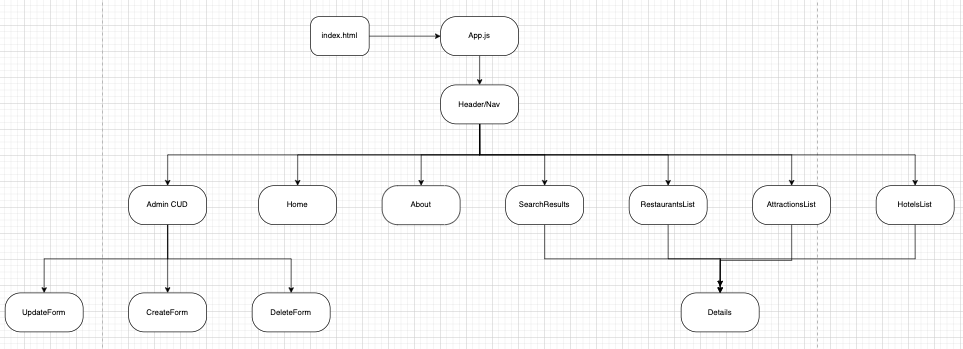
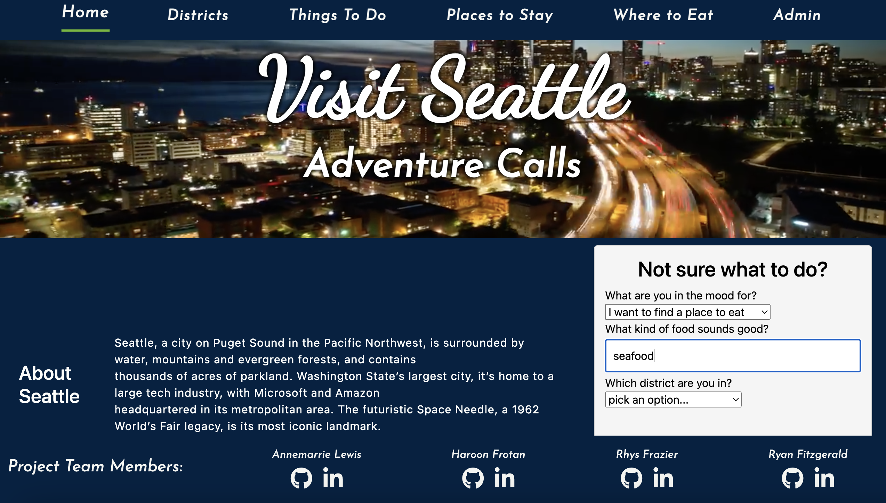
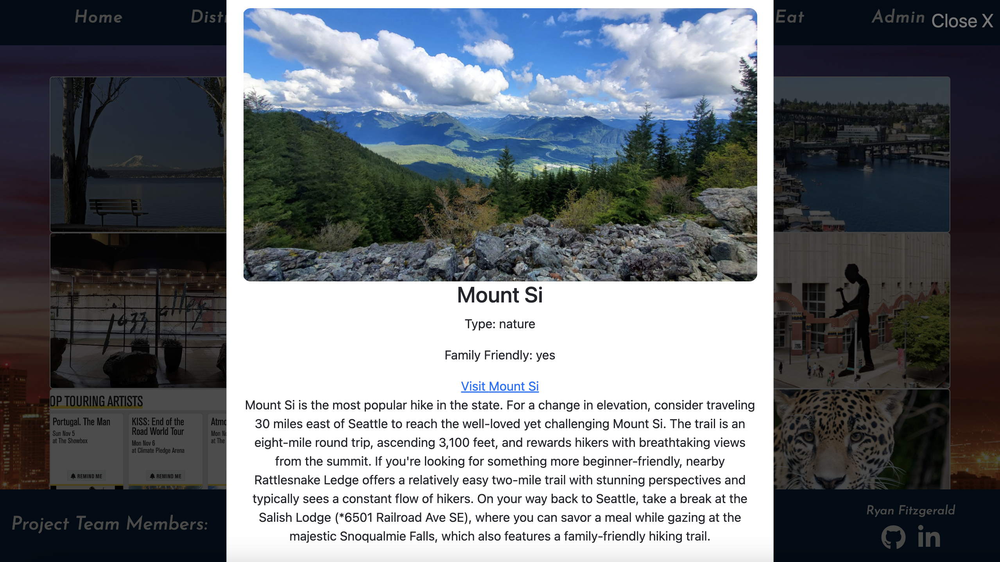
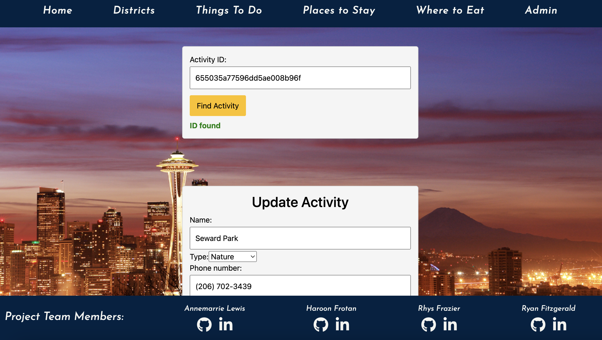

# Visit Seattle
Visit Seattle and experience all the city has to offer! Browse for restaurants, activities, and lodging, or, if you're in the area and not sure what to do, take our short quiz and get ideas!

Site administrators can quickly and easily add, update, and remove locations from the Visit Seattle's database as needed. Opening a new business and want to be featured on Visit Seattle? Contact us today!

## Meet the Team

#### Annemarie Lewis

github.com/annemarielewis

#### Haroon Frotan

github.com/HaroonFro

#### Rhys Frazier

github.com/rhysrfrazier

#### Ryan Fitzgerald

github.com/Ryan-Fitzgerald-9

## Project Planning
[Working Trello Board](https://trello.com/invite/b/Sw9RMhkn/ATTI9139af329e529594a9f5254f813eca8d46AF3B72/project-3)

### Entity Relationship Diagram (ERD)

### Home Page Wireframe

### Component Relationship Diagram

## Technologies Used
- MongoDB
- Express
- React
- NodeJS

## Current State
As of November 13th, 2023, site Visitors are welcomed by a drone-footage video of the city of Seattle on the homepage, along with information about the city and a brief quiz to help find restaurants or activities nearby.

Using the navigation bar across the top, they can view information about the various districts of Seattle, or browse things to do, places to stay and restaurants within the city.

## 

Finally, site administrators can add, remove, or update activities to ensure the site is as up-to-date as possible with this energetic city!

## Coming Soon

The Visit Seattle team is always striving to improve, so here are a few future plans we're working towards:
- Interactive map integration, so users can view all lodgings, activities, and restaurants in a given area by selecting the district
- Continued styling tweaks and improved responsive design
- Filtering within the list pages for restaurants, activities, and lodging
- Ability to view details of generated restaurants and activities directly from the quiz on the homepage
- User login and the ability to save favorites
- Admin login to access CUD operations
- CUD operations for lodgings and restaurants, in addition to activities